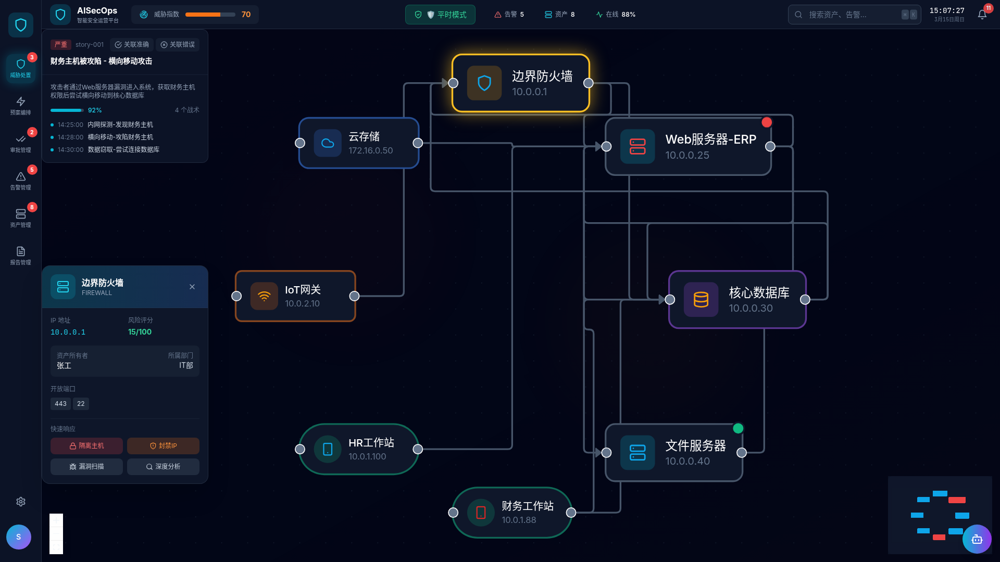
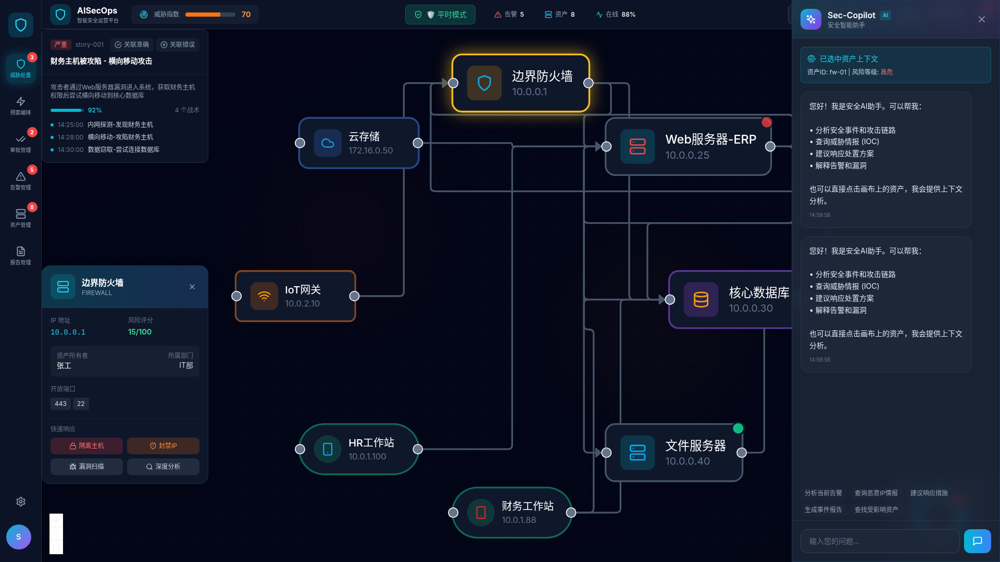
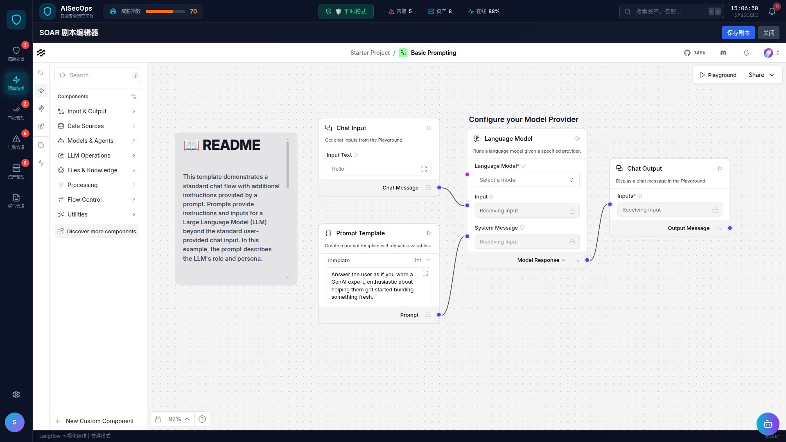

# AI-SecOps

> **注意**：当前项目还在最初期开发中，**功能尚未完全打通**，还不能直接部署运行起来。
>
> 感谢您给个Star持续关注，谢谢啦(#^.^#)

## 项目简介

AI-SecOps 是一款面向网络安全运营（SecOps）的智能告警分析与响应平台。在现代安全运营中心，安全分析师每天需要处理高达数十万条的告警（如EDR、防火墙日志），面临严重的警报疲劳问题。

## 核心挑战与约束

本项目针对以下三大严苛约束进行设计：

1. **算力与并发限制**：由于安全数据极度敏感，必须实现100%本地私有化部署，在有限GPU算力下处理高并发告警。
2. **零容忍"幻觉"**：AI误判可能导致灾难性生产事故（如将正常备份误判为勒索病毒并执行断网），因此系统采用多层级验证机制确保判断准确性。
3. **审计与合规**：所有AI推理步骤必须透明、可复现，高危操作强制介入人工审批（Human-in-the-Loop）。

## 架构设计

基于多流派融合Agent架构设计理念，AI-SecOps 将大模型解耦为多个专业处理层，实现告警的智能分析、关联与响应。系统采用分层架构，包括数据采集、标准化、图关联、压缩分析、编排调度、模拟仿真、执行与报告等完整链路。

## 技术栈

- **后端**：Python + FastAPI + Neo4j
- **前端**：React + TypeScript + TailwindCSS
- **AI编排**：Langflow/LangGraph
- **数据库**：SQLite + Neo4j
- **部署**：Docker Compose

## 界面截图

### 1. 威胁处置

### 2. AI Copilot智能助手

### 3. 威胁预案SOAR编排与自动化

